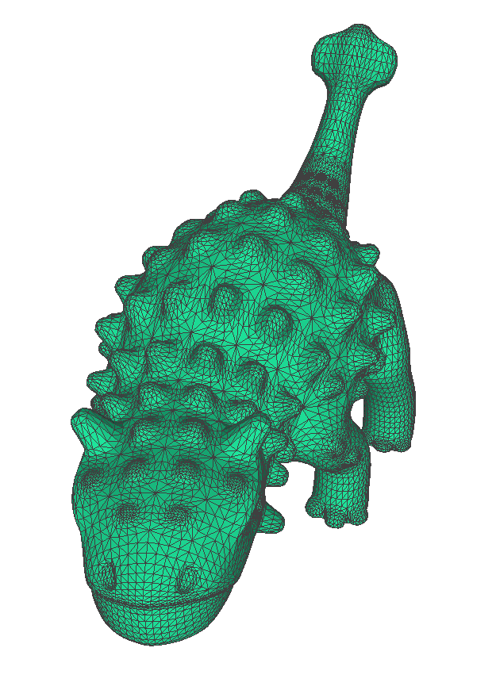
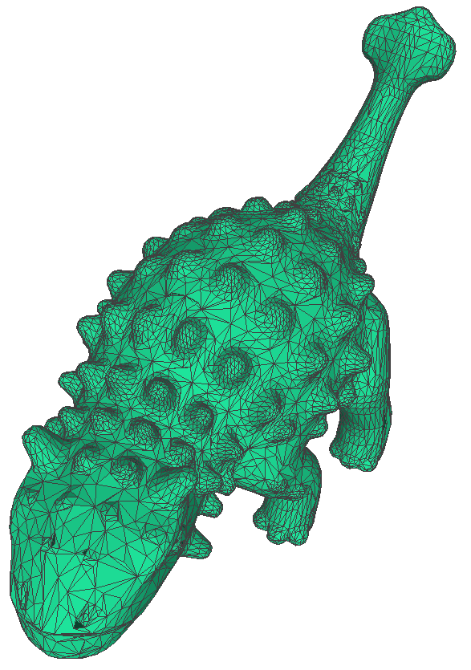
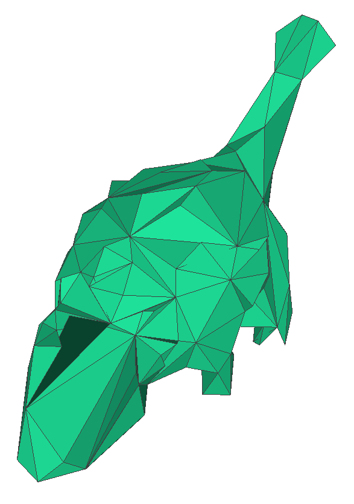
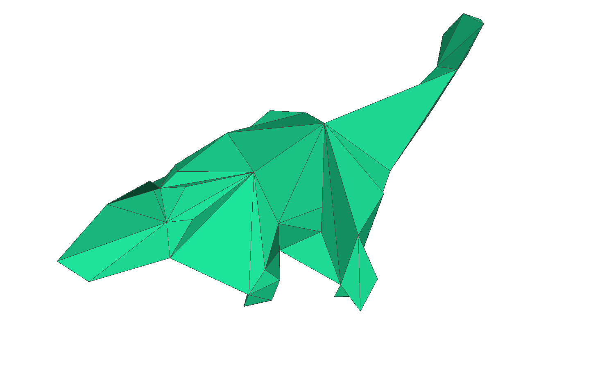
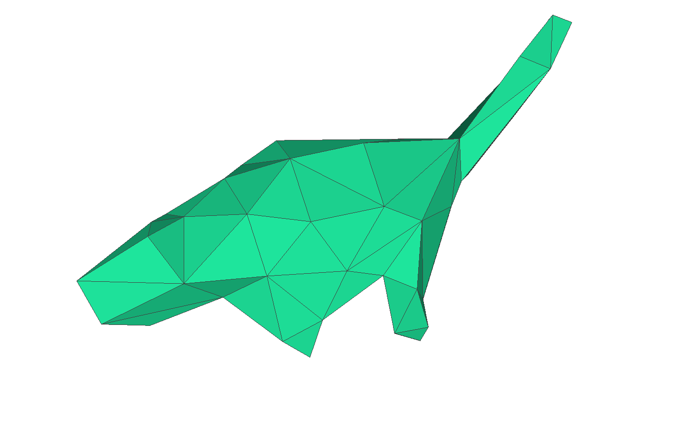

# メッシュ簡略化
"Surface Simplification using Quadric Error Metrics, 1997" [[Paper]](http://www.cs.cmu.edu/~garland/Papers/quadrics.pdf) を実装。

## アルゴリズム

### 概要
頂点 $\mathbf{v}=(v_x, v_y, v_z, 1)^T$ 
毎のコストを、
$4\times4$
対称行列
$Q$
を用いて、二次形式
$\Delta(\mathbf{v})=\mathbf{v}^T Q \mathbf{v}$
で定義。
縮約した場合に、コストが最小となる頂点ペアから縮約する。

### 手順
1. 初期頂点で対称行列
   $Q$
   を計算する（後述）
3. 縮約できる頂点ペアをリストアップする
4. 2.の各頂点ペアに対し、縮約した場合のコストを計算する
   - 頂点
$\mathbf{v}_1$
を
$\mathbf{v}_2$
にマージする場合、生成される頂点を
$\mathbf{\bar{v}}=\frac{1}{2}(\mathbf{v}_1+\mathbf{v}_2)$
として、
$\mathbf{\bar{v}}^T (Q_1+Q_2) \mathbf{\bar{v}}$
を頂点ペア
$(\mathbf{v}_1, \mathbf{v}_2)$
のコストとする。
4. 3.で計算した各頂点ペアのコストを格納するヒープを作成
5. ヒープから最小コストとなる頂点ペア
$(\mathbf{v}_1, \mathbf{v}_2)$
を取り出し、そのエッジを縮約する
   - この際、頂点
$\mathbf{v}_1$
が関与する全ての頂点ペアに対するコストを更新する
  
### Q の定義

頂点周りの平面（三角形）を表す方程式を、
$ax+by+cz+d=0$
とする。ただし、
$a^2+b^2+c^2=1$
である。
すなわち、
$(a, b, c)^T$
は三角形の法線ベクトルを意味し、三角形の重心座標を
$(c_x, c_y, c_z)$
とすると、

$$
d = -1 \times
\left[ 
\begin{matrix}
a\\
b\\
c\\
\end{matrix}
\right]
\cdot
\left[ 
\begin{matrix}
c_x\\
c_y\\
c_z\\
\end{matrix}
\right]
$$

と表せる。
$\mathbf{p}=(a,b,c,d)^T$
として、
頂点
$\mathbf{v}$
から周囲の平面（三角形）
$\mathbf{p}$
までの距離は

$$
\mathbf{p}^T \mathbf{v} = a v_x+ b v_y + c v_z + d
$$

と表現でき、これらの二乗誤差の総和は、

$$
\begin{align}
\Delta(\mathbf{v}) =& \sum_{\mathbf{p} \in N(\mathbf{v})}(\mathbf{p}^T \mathbf{v})^2 \\
=& \sum_{\mathbf{p} \in N(\mathbf{v})}(\mathbf{v}^T \mathbf{p})(\mathbf{p}^T \mathbf{v}) \\
=& \mathbf{v}^T \left(\sum_{\mathbf{p} \in N(\mathbf{v})}\mathbf{p}\mathbf{p}^T \right) \mathbf{v} \\
\end{align}
$$

となる。ここで、

$$ K_p = \mathbf{p}\mathbf{p}^T =
\left[
\begin{matrix} 
a^2 & ab & ac & ad \\ 
ab & b^2 & bc & bd \\
ac & bc & c^2 & cd \\
ad & bd & cd & d^2  
\end{matrix} 
\right]
$$

$$
Q = \sum_{\mathbf{p} \in N(\mathbf{v})} K_p
$$

と定義することで、頂点のコストを二次形式

$$\Delta(\mathbf{v})=\mathbf{v}^T Q \mathbf{v}$$

で表せる。

## ライブラリ
```
numpy
torch
```

## デモ

```
python simplification.py
```

<table>
  <tr>
    <td width="24%">入力</td>
    <td width="24%">簡略化(50%)</td>
    <td width="24%">簡略化(20%)</td>
    <td width="24%">簡略化(1%)</td>
  </tr>
  <tr>
    <td width="24%"></td>
    <td width="24%"></td>
    <td width="24%"></td>
    <td width="24%"></td>
  </tr>

  <tr>
    <td width="24%">14762 vertices</td>
    <td width="24%">7381 vertices</td>
    <td width="24%">2952 vertices</td>
    <td width="24%">147 vertices</td>
  </tr>
  <tr>
    <td width="24%">29520 faces</td>
    <td width="24%">14758 faces</td>
    <td width="24%">5900 faces</td>
    <td width="24%">290 faces</td>
  </tr>
</table>

本スクリプトは改良途中。
非多様体を生じるエッジ縮約や、境界エッジの縮約は行わない。
エッジ角度を考慮していないため、自己交差や面のフリップが生じうる。

### valenceを考慮したエッジ縮約

三角形品質を向上させるため、頂点毎のvalence（価数）を考慮したエッジ縮約を実装した。

<table>
  <tr>
    <td width="48%">valence考慮なし（簡略化0.5%）</td>
    <td width="48%">valence考慮あり（簡略化0.5%）</td>
  </tr>
  <tr>
    <td width="48%"></td>
    <td width="48%"></td>
  </tr>
  <tr>
    <td width="48%">
      <ul>
        <li>価数がバラバラ</li>
        <li>それ以上簡略化できない（valence=3の）頂点を生じる</li>
        <li>三角形の形状が不均一</li>
      </ul>
    </td>
    <td width="48%">
      <ul>
        <li>正三角形に近い形状に揃う</li>
      </ul>
    </td>
  </tr>
</table>

現在の実装では、境界がないメッシュを想定し、`valence=6`を最適とする重みづけを行う。すなわち、`valance`が6から離れるほど大きなペナルティが加わる。また、`valence=3`の頂点を生じるエッジ縮約には、過度に大きなペナルティを設定している。

valenceの考慮には、引数 `valence_aware`を設定する。
```
simp_mesh = mesh.simplification(target_v=v1, valence_aware=True)
```

## TODO

- [x] （縮約すると多様体を生じる）valence=3の頂点を発生させないようにする
- [ ] エッジ角度を考慮した縮約
- [ ] 更新後頂点位置の最適化（現在は中点）

## 実装メモ

- `vert_map`: 各頂点**に**どの頂点**が**マージされたか、を保持。1対多。
  - 自身の頂点番号で初期化
  - v2をv1にマージする場合、v2のsetをv1のsetに統合し、v2のsetを空にする

- `vert_dict`: 各頂点**が**どの頂点**に**マージされたか、を保持。1対1。

- `face_map`: 簡略前の頂点番号が簡略後にどの頂点番号に移動するか、を保持。1対1。