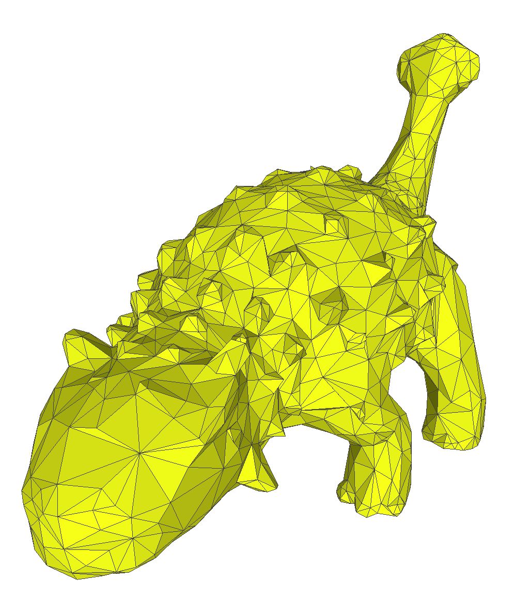
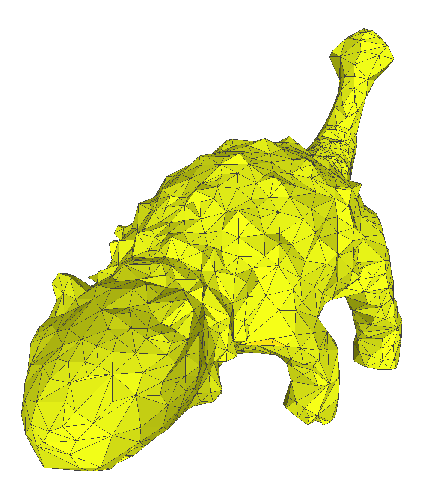

[English] [[Japanese]](README_ja.md)

# Mesh Simplification

The python script for "Surface Simplification Using Quadric Error Metrics, 1997" [[Paper]](http://www.cs.cmu.edu/~garland/Papers/quadrics.pdf)


## Environments
```
pytorch==1.7
scipy==1.6
numpy==1.19
scikit-learn==0.24
```

## Usage

```
python simplification.py [-h] -i data/ankylosaurus [-v V] [-p P] [-optim] [-isotropic]
```
A simplified mesh will be output in `data/output/`.

### Parameters
- `-i`: Input file name [Required]
- `-v`: Target vertex number [Optional]
- `-p`: Rate of simplification [Optional (Ignored by -v) | Default: 0.5]
- `-optim`: Specify for valence aware simplification [Optional | Recommended]
- `-isotropic`: Specify for isotropic simplification [Optional]

___

## Example

<table>
  <tr>
    <td width="24%">Input</td>
    <td width="24%">Result (50%)</td>
    <td width="24%">Result (20%)</td>
    <td width="24%">Result (1%)</td>
  </tr>
  <tr>
    <td width="24%"></td>
    <td width="24%"></td>
    <td width="24%"></td>
    <td width="24%"></td>
  </tr>

  <tr>
    <td width="24%">14762 vertices</td>
    <td width="24%">7381 vertices</td>
    <td width="24%">2952 vertices</td>
    <td width="24%">147 vertices</td>
  </tr>
  <tr>
    <td width="24%">29520 faces</td>
    <td width="24%">14758 faces</td>
    <td width="24%">5900 faces</td>
    <td width="24%">290 faces</td>
  </tr>
</table>

### Valence-aware simplification

Implementation of valence-aware simplification to improve the quality of triangles

<table>
  <tr>
    <td width="48%">Straight forward (0.5%)</td>
    <td width="48%">valence-aware (0.5%)</td>
  </tr>
  <tr>
    <td width="48%"></td>
    <td width="48%"></td>
  </tr>
  <tr>
    <td width="48%">
      <ul>
        <li>Uneven valence</li>
        <li>Valence 3 occurs (Big problem)</li>
      </ul>
    </td>
    <td width="48%">
      <ul>
        <li>Valence 6 increased</li>
        <li>Close to regular triangle</li>
      </ul>
    </td>
  </tr>
</table>

The further the valence is away from 6, the heavier the penalty. An excessively large penalty is set for an edge contraction that results in valence 3.

### Isotropic Simplification
Implementation of isotropic simplification to enhance edge length uniformity

<table>
  <tr>
    <td width="48%">Default (10%)</td>
    <td width="48%">Isotropic (10%)</td>
  </tr>
  <tr>
    <td width="48%"></td>
    <td width="48%"></td>
  </tr>
  <tr>
    <td width="48%">
      <ul>
        <li>Uneven edge length</li>
        <li>Feature preserved</li>
      </ul>
    </td>
    <td width="48%">
      <ul>
        <li>Even edge length</li>
        <li>Feature smoothed</li>
      </ul>
    </td>
  </tr>
</table>

___

## Algorithm

### Overview

Define the cost function of each vertex
$\mathbf{v}=(v_x, v_y, v_z, 1)^T$ 
by using the symmetric matrix
$Q$

$$\Delta(\mathbf{v})=\mathbf{v}^T Q \mathbf{v}$$

Then iteratively remove the pair of least cost.

### Procedure

1. Compute the symmetric matrix
$Q$
for all the initial vertices.
2. Select all valid pairs.
3. Compute the optimal contratcion for each valid pair.
  - When merging
  $\mathbf{v}_1$
  to
  $\mathbf{v}_2$
  , the cost of the contraction is defined as
  $\mathbf{\bar{v}}^T (Q_1+Q_2) \mathbf{\bar{v}}$
  , where 
  $\mathbf{\bar{v}}=\frac{1}{2}(\mathbf{v}_1+\mathbf{v}_2)$
  means the newly inserted vertex.
4. Place all the pairs in a heap.
5. Iteratively remove the pair
$(\mathbf{v}_1, \mathbf{v}_2)$
of least cost from the heap, and update the costs of all valid pairs involving
$\mathbf{v}_1$
.

### Definition of Q

A plane can be definedby the equation
$ax+by+cz+d=0$
where
$a^2+b^2+c^2=1$
.
Note that
$(a, b, c)^T$
means the facet normal of the plane.
When we define the barycenter of the plane as 
$(c_x, c_y, c_z)$
,

$$
d = -1 \times
\left[ 
\begin{matrix}
a\\
b\\
c\\
\end{matrix}
\right]
\cdot
\left[ 
\begin{matrix}
c_x\\
c_y\\
c_z\\
\end{matrix}
\right].
$$


The distance from a vertex
$\mathbf{v}$
to the plane
$\mathbf{p}=(a,b,c,d)^T$
can be defined as

$$
\mathbf{p}^T \mathbf{v} = a v_x+ b v_y + c v_z + d
$$

and, the sum of squared distances to its planes can be defined as

$$
\begin{align}
\Delta(\mathbf{v}) =& \sum_{\mathbf{p} \in N(\mathbf{v})}(\mathbf{p}^T \mathbf{v})^2 \\
=& \sum_{\mathbf{p} \in N(\mathbf{v})}(\mathbf{v}^T \mathbf{p})(\mathbf{p}^T \mathbf{v}) \\
=& \mathbf{v}^T \left(\sum_{\mathbf{p} \in N(\mathbf{v})}\mathbf{p}\mathbf{p}^T \right) \mathbf{v}. \\
\end{align}
$$

By introducing
$K_p$
as

$$ K_p = \mathbf{p}\mathbf{p}^T =
\left[
\begin{matrix} 
a^2 & ab & ac & ad \\ 
ab & b^2 & bc & bd \\
ac & bc & c^2 & cd \\
ad & bd & cd & d^2  
\end{matrix} 
\right],
$$

the error metric can be rewritten as a quadric form

$$\Delta(\mathbf{v})=\mathbf{v}^T Q \mathbf{v}$$
where

$$
Q = \sum_{\mathbf{p} \in N(\mathbf{v})} K_p .
$$

___

## Limitation
We consider only a mesh without boundary.
